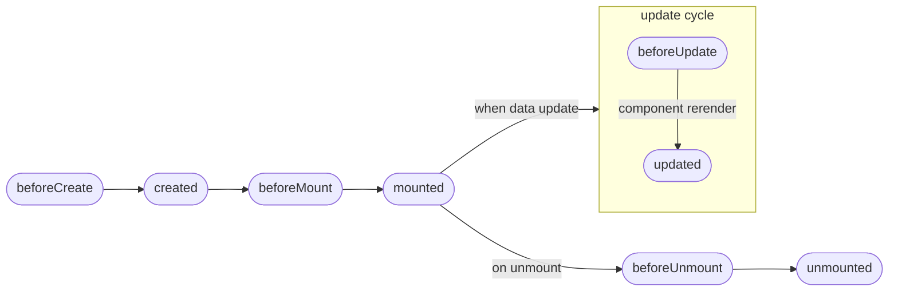
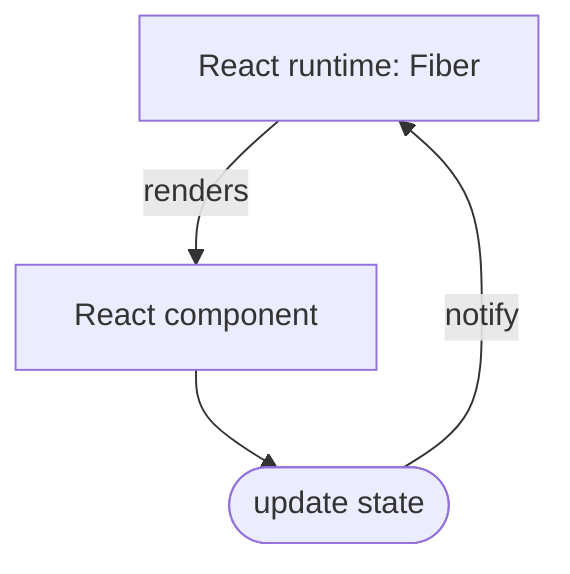

<style>
  .slidev-code {
    min-width: 400px;
  }
</style>

# Introduction to React

---
layout: cover
type: secondary
---

# About React

---
layout: two-cols
---

<style>
  .col-left.slidev-page-3 {
    display: grid;
    height: 100%;
    align-items: center;
  }
</style>

<div>

  # React is

  - First release in May 2013
  - Maintained by Meta and community
  - Written in JavaScript
  - Focused on state management & DOM render
  - The first to introduce JSX

</div>

::right::

<div class="grid items-center justify-center h-full">
  
</div>

---
layout: cover
type: secondary
---

# JSX? What's that?

---
layout: center
---

# Before explaining JSX...<br />Do you know how SFC work in Vue?

---
layout: two-cols
---

::default::

```jsx
<template>
  <ul>
    <li v-for="{ id, text } in myList" :key="id">
      {{ text }}
    </li>
  </ul>
</template>

<script>
  export default {
    props: {
      myList: {
        type: Array
      }
    }
  }
</script>
```

::right::

<v-click>

```js
export default {
  props: {
    myList: {
      type: Array
    }
  },
  render(h) {
    return h(
      'ul',
      this.myList.map(({ id, text }) => {
        return h('li', { key: id }, text);
      }),
    );
  },
}
```

</v-click>

---
layout: two-cols
---

::default::

```js {0}
<template>
  <ul>
    <li v-for="{ id, text } in myList" :key="id">
      {{ text }}
    </li>
  </ul>
</template>

<script>
  export default {
    props: {
      myList: {
        type: Array
      },
    },
  };
</script>
```

::right::

```js {8-13}
export default {
  props: {
    myList: {
      type: Array
    }
  },
  render(h) {
    return h(
      'ul',
      this.myList.map(({ id, text }) => {
        return h('li', { key: id }, text);
      }),
    );
  },
}
```

---
layout: two-cols-title
---

::title::

# JSX is syntactic sugar for hyperscript

::default::

```js
h(
  'ul',
  items.map(({ id, text }) => {
    return h('li', { key: id }, text);
  })
);
```

::right::

```jsx
<ul>
  {items.map(({ id, text }) => {
    return <li key={id}>{text}</li>
  })}
</ul>
```

---
layout: cover
type: secondary
---

# Components lifecycle

---
layout: center
---

# Vue

(See a more detailed version [here](https://vuejs.org/guide/essentials/lifecycle.html#lifecycle-diagram))



---
layout: center
---

# React

- Components are functions
- Those components are rendered by a runtime called `Fiber`
- When you update the component state, you tell `Fiber` to re-render the entire component

<br /><br />
<div class="grid place-content-center">



</div>

---
layout: cover
type: secondary
---

# React with examples

---
layout: cover
type: tertiary
---

# Passing/receiving props

---
layout: two-cols
---

::default::

## Vue

Component:
```jsx
<template>
  <div>{{ myNumber }}</div>
</template>

<script lang="ts">
export default {
  props: {
    myNumber: {
      type: Number
    }
  }
}
</script>
```

Usage:
```jsx
<template>
  <MyComponent :myNumber="3" />
</template>
```


::right::

<v-click>

## React

Component:
```tsx
interface Props {
  myNumber: number;
}

export function MyComponent({ myNumber }: Props) {
  return <div>{myNumber}</div>
}

// Could also be written as
export function MyComponent(props: Props) {
  return <div>{props.myNumber}</div>
}
```

Usage:
```tsx
<MyComponent myNumber={3} />
```

</v-click>

---
layout: cover
type: tertiary
---

# Component state management

---
layout: two-cols
---

::default::

## Vue

Component:

```jsx
<template>
  <div>
    <div>{{ count }}</div>
    <button @click="increment">Increment</button>
  </div>
</template>

<script lang="ts">
export default {
  data() {
    return { count: 0 };
  },
  methods: {
    increment() {
      this.count++;
    }
  }
}
</script>
```

::right::

<v-click>

## React


`useState` usage:

```ts
const [value, setValue] = useState(initialValue);
```

</v-click>

<v-click>

Component:

```tsx
export function Counter() {
  const [count, setCount] = useState(0);
  const increment = () => setCount(count + 1);

  return (
    <div>
      <div>{count}</div>
      <button onClick={increment}>Increment</button>
    </div>
  )
}
```

</v-click>

---
layout: cover
type: tertiary
---

# Side effects
(anything not related to render: API calls, set a listener, logging, etc...)

---
layout: two-cols
---

::default::

## Vue

Component:

```tsx
<template>
  <div>
    <div v-if="user">
      <div>Username: {{ user.name }}</div>
      <div>Email: {{ user.email }}</div>
    </div>
    <div v-else>Fallback</div>
  </div>
</template>

<script lang="ts">
export default {
  props: {
    userId: {
      type: String
    }
  },
  data(): { user: User | null } {
    return { user: null }
  },
  async mounted() {
    this.user = await this.fetchUser(this.props.userId);
  },
  watch: {
    async userId(newId: string) {
      this.user = await this.fetchUser(newId);
    },
  },
  methods: {
    fetchUser(userId: string) {
      return MyAPI.getUser(userId);
    }
  }
}
</script>
```

::right::

<v-click>

## React

Component:

```tsx
interface Props {
  userId: string;
}

export function UserProfile({ userId }: Props) {
  const [user, userId] = useState<User | null>(null);

  useEffect(() => {
    MyAPI.getUser(userId).then(setUser);
  }, [userId]);

  if (!user) {
    return <div>Fallback</div>;
  }

  return (
    <div>
      <div>Username: {user.name}</div>
      <div>Email: {user.email}</div>
    </div>
  );
}
```

</v-click>

---
layout: center
---

# More on `useEffect`

```ts
useEffect(fn: ExecuteFunction, dependenciesArray?: unknown[]);
```

- It's used to run side effects **after** the render:
  - Calling an API
  - Adding an event listener to a DOM element
  - Connecting to a websocket
  - etc...
- It takes 2 arguments:
  - A function to execute
  - An optional array of dependencies

---
layout: center
---

# `useEffect` with no dependencies array

With no dependencies array the function is executed after every render

```tsx {2-4}
function MyComponent() {
  useEffect(() => {
    console.log('I will be executed after every render');
  });

  return null;
}
```

---
layout: center
---

# `useEffect` with an empty dependencies array

With an empty dependencies array the function will only be executed after the first render

```tsx {2-4}
function MyComponent() {
  useEffect(() => {
    console.log('I will only be executed after the first render');
  }, []);

  return null;
}
```

---
layout: center
---

# `useEffect` with non empty dependencies array

With an non empty dependencies array the function will render when any the value change between renders

```tsx {2-4}
function UserProfile({ userId, isShort }: Props) {
  useEffect(() => {
    console.log('I will be executed whether userId or isShort value is different');
  }, [userId, isShort]);

  return null;
}
```

---
layout: cover
type: tertiary
---

# Passing children to a component

---
layout: two-cols
---

::default::

## Vue

Component:

```tsx
<template>
  <button>
    <slot />
  </button>
</template>

<script>
  export default {
    name: 'MyButton'
  };
</script>
```

Usage:

```tsx
<template>
  <MyButton>My button text</MyButton>
</template>
```

::right::

<v-click>

## React

Component:

```tsx
import type { PropsWithChildren as WithChildren } from 'react';

export function MyButton({ children }: WithChildren) {
  return <button>{children}</button>
}
```

Usage:

```tsx
<MyButton>My button text</MyButton>
```

</v-click>

---
layout: cover
type: tertiary
---

# "emit" in a component

---
layout: two-cols
---

::default::

## Vue

Component:

```tsx
<template>
  <button @click="emit('myCustomClick')">
    <slot />
  </button>
</template>

<script>
export default {
  name: 'MyButton'
}
</script>
```

Usage:

```tsx
<template>
  <MyButton @myCustomClick="doSomething">
    My button text
  </MyButton>
</template>

<script>
export default {
  methods: {
    doSomething() {
      console.log('I am doing something');
    },
  },
};
</script>
```

::right::

<v-click>

## React

Component:

```tsx
import type { PropsWithChildren as WithChildren } from 'react';

interface Props {
  myCustomClick: (e: MouseEvent) => void;
}

export function MyButton({ children, myCustomClick }: WithChildren<Props>) {
  return <button onClick={myCustomClick}>{children}</button>
}
```

Usage:

```tsx
export function UsageComponent() {
  const doSomething = () => {
    console.log('I am doing something');
  };

  return (
    <MyButton myCustomClick={doSomething}>My button text</MyButton>
  );
}
```

</v-click>

---
layout: cover
type: tertiary
---

# Using styles/CSS

---
layout: center
---

# Vue

<div class="grid">

```tsx
<template>
  <button class="my-button">
    My text
  </button>
</template>

<script>
export default {
  name: 'MyButton',
};
</script>

<style scoped>
.my-button {
  padding: 4px 12px;
  /* ... */
}
</style>
```

</div>

---
layout: center
---

# With React

- There is many standard ways to do CSS when coupling it with JS
  - CSS Modules (https://github.com/css-modules/css-modules)
  - CSS in JS (https://en.wikipedia.org/wiki/CSS-in-JS)
- React does not care how you do it
- At Toucan we chose to use CSS in JS because:
  - There's no need to import manually the CSS file
  - Styles are scoped and are operable via props
  - We're in full TypeScript, so we benefit of typechecking
  - Better readability of a component

---
layout: center
---

# React with CSS in JS

```tsx
import styled from 'styled-components';

const StyledButton = styled.button`
  padding: 4px 12px;
`;

export function MyButton() {
  return <StyledButton>My text</StyledButton>
}
```

---
layout: cover
type: secondary
---

# Live Coding