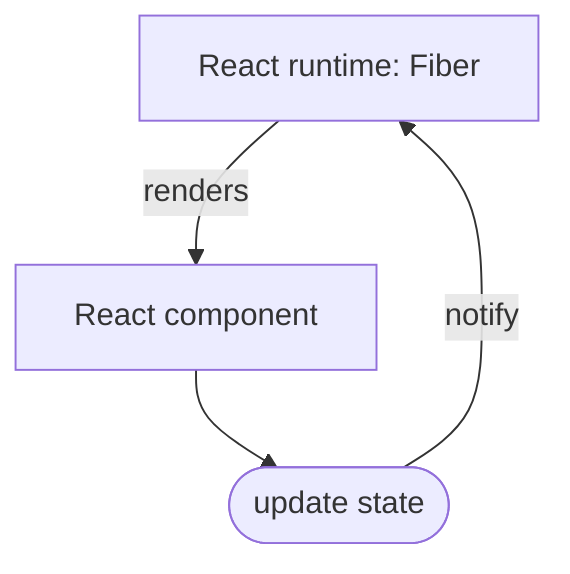

# React

- Components are functions
- Those components are rendered by a runtime called `Fiber`
- When you update the component state, you tell `Fiber` to re-render the entire component

  

```mermaid
flowchart TD
  Fiber[React runtime: Fiber] -- renders --> ReactComponent
  ReactComponent[React component] --> updateState
  updateState([update state]) -- notify --> Fiber
```

