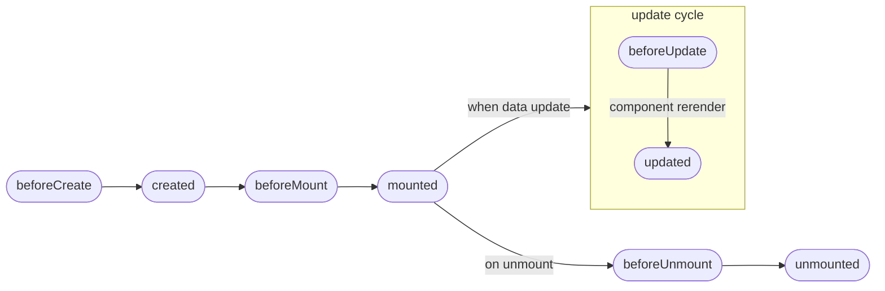

# Vue

(See a more detailed version [here](https://vuejs.org/guide/essentials/lifecycle.html#lifecycle-diagram))

```mermaid
flowchart LR
  beforeCreate([beforeCreate]) --> created
  created([created]) --> beforeMount
  beforeMount([beforeMount]) --> mounted

  mounted([mounted]) -- on unmount --> beforeUnmount
  beforeUnmount([beforeUnmount]) --> unmounted
  unmounted([unmounted])

  subgraph updateCycle [update cycle]
    beforeUpdate([beforeUpdate]) -- component rerender --> updated
    updated([updated])
  end

  mounted -- when data update --> updateCycle
```
